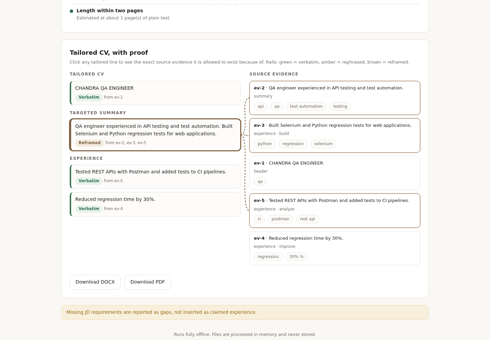

# Grounded CV RAG Tailor

Tailor your CV to a job description with **proof, not promises**. Every changed line links to the exact base-CV evidence it is allowed to exist because of. Anything the evidence cannot back is reported as a gap or blocked outright - never invented.




## What it does

- **Requirement-coverage matrix, not a fake ATS score.** Real applicant tracking systems run keyword searches and knockout filters; they do not hand candidates a percentage. The app parses the job description into hard and preferred requirements (including years-per-skill) and shows coverage per requirement, with evidence links.
- **ATS parseability check.** Flags tables, multi-column layouts, non-standard section names, missing contact details, unparseable dates, and over-length CVs - the things that actually break parsers.
- **A verification gate, not a prompt.** After generation, every line must pass three deterministic checks or it is blocked and removed:
  1. **Number allowlist** - any number not present in your base CV is blocked.
  2. **Entity allowlist** - any tool, certification, employer, or title not present in your base CV is blocked.
  3. **Entailment** - every generated sentence must be entailed by the evidence it cites.
- **Provenance labels.** Every tailored line is labeled **verbatim** (copied exactly), **rephrased** (same words, reordered), or **reframed** (a new framing of cited evidence). Click any line to see its source evidence, connected visually.
- **Structured evidence records.** Your CV is parsed into records with role, employer, date range, skills, quantified outcomes, and action-verb class - structure is what makes the guards enforceable.
- **Page budget.** Choose a 1-page or 2-page CV; the strongest evidence is selected to fit, and omissions are logged.
- **Batch JD ranking.** Paste several job descriptions and see which roles your CV already fits best, ranked by hard-requirement coverage.
- **Private by design.** Everything runs locally. Uploaded files (.txt, .md, .pdf, .docx) are processed in memory and never written to disk or sent anywhere.
- **Export** the reviewed result as DOCX or PDF, with the coverage report attached.

## Prerequisites

- Python 3.10 or newer
- Windows, macOS, or Linux

Check your Python:

```powershell
python --version
```

If that fails on Windows, install Python from https://www.python.org/downloads/ and tick **Add python.exe to PATH** during setup.

## Setup

**Windows (PowerShell):**

```powershell
git clone https://github.com/dcr6174/cv-rag-tailor.git
cd cv-rag-tailor
python -m venv .venv
.venv\Scripts\Activate.ps1
pip install -r requirements.txt
uvicorn cv_tailor.api:app --app-dir src
```

If PowerShell blocks the activate script, run this once first:

```powershell
Set-ExecutionPolicy -ExecutionPolicy RemoteSigned -Scope CurrentUser
```

**macOS / Linux:**

```bash
git clone https://github.com/dcr6174/cv-rag-tailor.git
cd cv-rag-tailor
python3 -m venv .venv
source .venv/bin/activate
pip install -r requirements.txt
uvicorn cv_tailor.api:app --app-dir src
```

Then open http://127.0.0.1:8000 in your browser.

## Try it in one click

1. Start the app and open http://127.0.0.1:8000.
2. Click **Load the sample job + CV**.
3. Click **Tailor my CV**.
4. Click any tailored line to see the evidence it came from, connected by a line. Check the coverage matrix, the parseability checks, and the provenance labels.
5. Click **Download DOCX** or **Download PDF**.

The sample pair covers 1 of 2 hard requirements fully, reports Playwright, CI/CD, and performance testing as honest gaps, and never inserts them into the tailored CV.

## Batch ranking

Open the **Batch rank JDs** tab, paste your base CV and several job descriptions separated by a line containing only `---`, and click **Rank these jobs**. You get a sorted table: weighted coverage, hard/preferred requirement counts, and top gaps for each role.

## Common errors

| Error | Fix |
| --- | --- |
| `python is not recognized` (Windows) | Reinstall Python and tick **Add python.exe to PATH**, then reopen PowerShell. |
| `cannot be loaded because running scripts is disabled` | Run `Set-ExecutionPolicy -ExecutionPolicy RemoteSigned -Scope CurrentUser` once. |
| `No module named 'cv_tailor'` | Start the server with `--app-dir src` from the repo folder, as shown above. |
| `port 8000 is already in use` | Use another port: `uvicorn cv_tailor.api:app --app-dir src --port 8001`. |
| `Unsupported file type` | Upload .txt, .md, .pdf, or .docx only. |
| `No readable text was found` | The PDF may be a scanned image; export it as text first. |

## API

| Endpoint | Purpose |
| --- | --- |
| `GET /` | Browser interface |
| `GET /health` | Health check |
| `GET /samples` | Sample job description and CV |
| `POST /tailor` | Tailor pasted text (`job_description`, `base_cv`, `page_budget` 1-2) |
| `POST /tailor-upload` | Tailor an uploaded CV file (`.txt`, `.md`, `.pdf`, `.docx`, max 5 MB) |
| `POST /rank` | Rank several job descriptions against one CV |
| `POST /export/docx` | Download the tailored CV as DOCX |
| `POST /export/pdf` | Download the tailored CV as PDF |

Interactive API docs: http://127.0.0.1:8000/docs

## Tests

```bash
pip install -r requirements-dev.txt
pytest
```

47 tests cover evidence parsing, requirement extraction, BM25 retrieval, the verification gates, provenance labels, page budgets, batch ranking, the API, and both export formats.

## Privacy

- No accounts, no tracking, no external API calls.
- Uploaded files are read into memory, text is extracted, and the bytes are discarded.
- Nothing you paste or upload leaves your computer.
