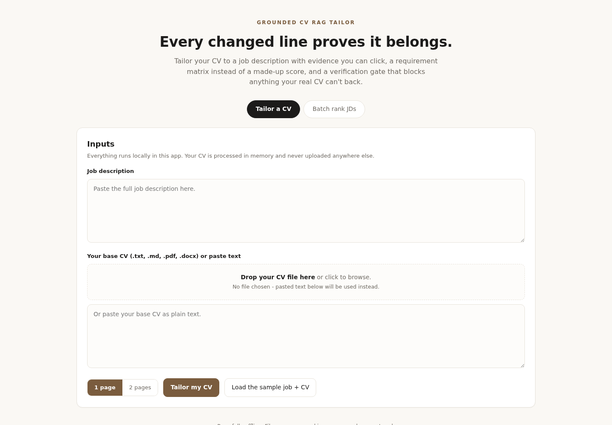
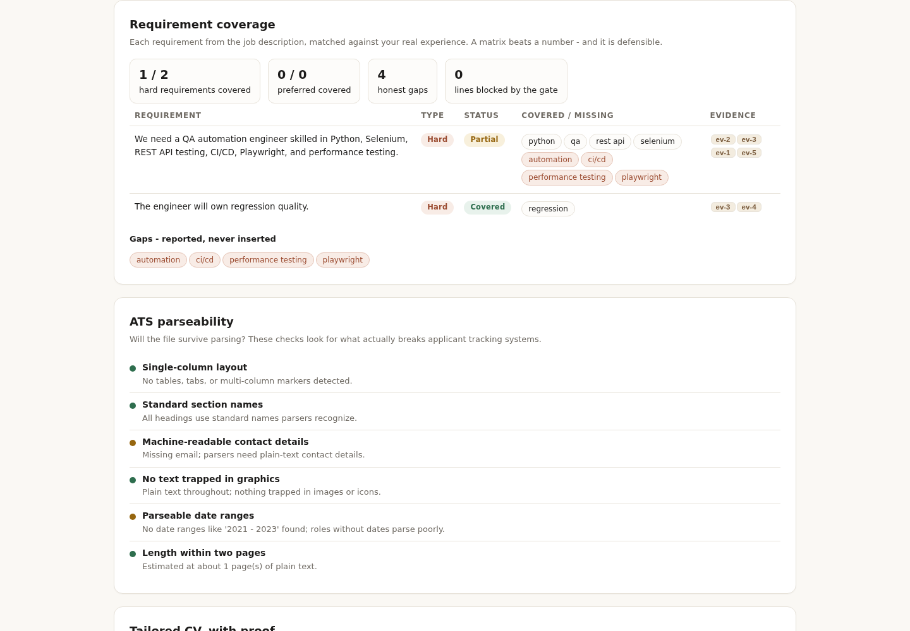

# Grounded CV RAG Tailor

Tailor your CV to a job description in your browser, without inventing anything. The app retrieves evidence from your base CV, builds a targeted summary from that evidence only, scores the match, shows skill gaps honestly, and exports the result as DOCX or PDF. Everything runs on your own machine. No account, no API key, no upload to any server.



## What it does

1. You paste a job description and add your CV (`.txt`, `.md`, `.pdf`, or `.docx`).
2. The app retrieves the CV passages most relevant to the job description.
3. You get a keyword match score (0-100), matched skills, skill gaps, and honesty checks.
4. Your original and tailored CV appear side by side, with every change highlighted and linked to the CV evidence behind it.
5. You download the tailored CV as DOCX or PDF.

The base CV is the only source of truth. A skill the job wants but your CV does not show appears as a **gap**, never as a fake claim. New numbers that are not in your base CV are flagged.



## Prerequisites

- **Python 3.10 or newer.** Check with `python --version` (Windows) or `python3 --version` (Mac/Linux). Download from [python.org](https://www.python.org/downloads/) if you do not have it. On Windows, tick **"Add python.exe to PATH"** during installation.
- **Git**, to clone the project. Or download it as a ZIP: on the GitHub page click the green **Code** button, then **Download ZIP**, and unzip it.

## Set up on Windows (PowerShell)

Open PowerShell, then copy and paste each line:

```powershell
git clone https://github.com/dcr6174/cv-rag-tailor.git
cd cv-rag-tailor
python -m venv .venv
.venv\Scripts\activate
pip install -r requirements.txt
uvicorn cv_tailor.api:app --app-dir src
```

Leave the PowerShell window open while you use the app.

## Set up on Mac or Linux (Terminal)

```bash
git clone https://github.com/dcr6174/cv-rag-tailor.git
cd cv-rag-tailor
python3 -m venv .venv
source .venv/bin/activate
pip install -r requirements.txt
uvicorn cv_tailor.api:app --app-dir src
```

Leave the terminal window open while you use the app.

## Use the app

1. Open **http://127.0.0.1:8000** in your browser.
2. Click **"Load the sample job + CV"** for an instant demo, or:
   - Paste a real job description.
   - Drop in your CV file (or click "or paste CV text instead").
3. Click **Tailor my CV**.
4. Read the match score, matched keywords, skill gaps, and the side-by-side comparison.
5. Click **Download DOCX** or **Download PDF** to save the tailored CV.

To stop the app, press `Ctrl+C` in the terminal window.

### Expected output

For the included sample (a QA automation job description and a matching sample CV) you should see:

- A match score ring, about **71/100** for the sample pair
- Green chips for matched keywords such as `python`, `selenium`, `api`
- Warm chips for gaps such as `playwright` and `performance`, under "reported, not added"
- A highlighted **TARGETED SUMMARY** on the tailored side, built from retrieved CV evidence
- Evidence cards (`cv-1`, `cv-2`, ...) showing exactly which CV passages were used

## Common errors and fixes

| Error | Fix |
| --- | --- |
| `python is not recognized` (Windows) | Reinstall Python from python.org and tick **"Add python.exe to PATH"**. Or try `py -m venv .venv` instead of `python -m venv .venv`. |
| `.venv\Scripts\activate : cannot be loaded because running scripts is disabled` (Windows) | In PowerShell run `Set-ExecutionPolicy -ExecutionPolicy RemoteSigned -Scope CurrentUser`, answer **Y**, then run the activate line again. |
| `No module named 'cv_tailor'` | You forgot `--app-dir src`. Run `uvicorn cv_tailor.api:app --app-dir src` from inside the project folder. |
| `pip is not recognized` (Windows) | Use `python -m pip install -r requirements.txt`. |
| Port 8000 already in use | Run on another port: `uvicorn cv_tailor.api:app --app-dir src --port 8001`, then open http://127.0.0.1:8001. |
| `Unsupported file type` when uploading | Convert your CV to `.txt`, `.md`, `.pdf`, or `.docx` and try again. |
| The page shows nothing / connection refused | The app is not running. Go back to the terminal, start it again, and keep that window open. |

## API (for developers)

Interactive docs live at **http://127.0.0.1:8000/docs** while the app runs.

| Endpoint | Purpose |
| --- | --- |
| `GET /` | The browser interface |
| `GET /health` | Health check |
| `GET /samples` | The sample job description and CV as JSON |
| `POST /tailor` | JSON body `{"job_description": ..., "base_cv": ...}` returns the full tailoring result |
| `POST /tailor-upload` | Multipart form: `job_description` field plus a `cv` file (`.txt`/`.md`/`.pdf`/`.docx`) |
| `POST /export/docx` | JSON body with `tailored_cv`, `score`, `matched`, `missing` returns a Word file |
| `POST /export/pdf` | Same body, returns a PDF |

`POST /tailor` returns:

- `tailored_cv`: original CV plus a grounded targeted summary
- `match_report`: 0-100 keyword coverage, matched terms, missing terms, and evidence coverage
- `evidence`: ranked source chunks with stable IDs and matched terms
- `gaps`: JD terms absent from the CV
- `change_log`: each edit, its reason, and supporting evidence IDs
- `warnings`: missing-skill and unsupported-number checks

## Why this is RAG

The job description is the query. The base CV is split into evidence chunks, normalized, and ranked by term overlap. Only retrieved chunks may feed the targeted summary, and every change carries evidence IDs so a reviewer can trace it back to the CV.

```text
JD -> normalization/keywords ----\
                                  -> evidence retriever -> grounded summary
Base CV -> chunking/tokenization -/                         |
            |                                               v
            +-----------------> ATS report + gaps -> response + change log
                                                        |
                                                        v
                                                fabrication guards
```

The implementation is deterministic and offline. No API key, hosted LLM, candidate data upload, or external service is required. A production extension can place a schema-constrained LLM behind the same evidence contract and reject output whose claims lack evidence IDs. The ATS-style score is a transparent keyword heuristic, not an employer ATS and not a hiring prediction.

## Run the tests

```bash
pip install -r requirements-dev.txt
python -m pytest tests/ -q
```

The suite covers normalization, chunking, retrieval, stable evidence IDs, ATS scoring, missing-skill handling, change provenance, quantified-claim checks, the browser page, file upload and extraction, fabrication-guard enforcement through the upload path, and DOCX/PDF export. 27 tests, all passing.

## Safety and privacy

- The base CV is the sole experience source; gaps are reported, never inserted.
- Uploaded files are read in memory and never written to disk or sent anywhere.
- `.env`, PDFs, DOCX files, and generated output are git-ignored.
- No credentials, tokens, or personal data are needed or stored.

## License

MIT. See [LICENSE](LICENSE).
